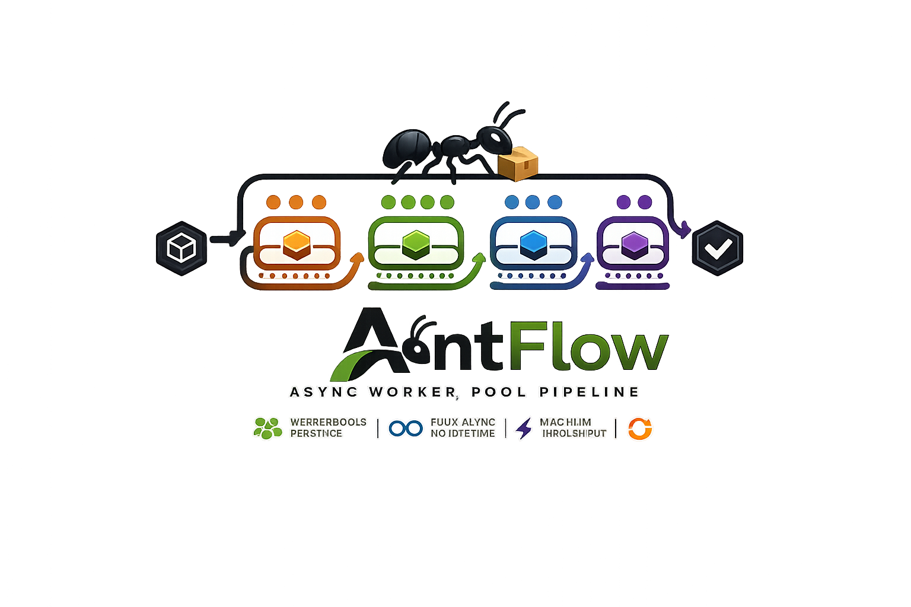
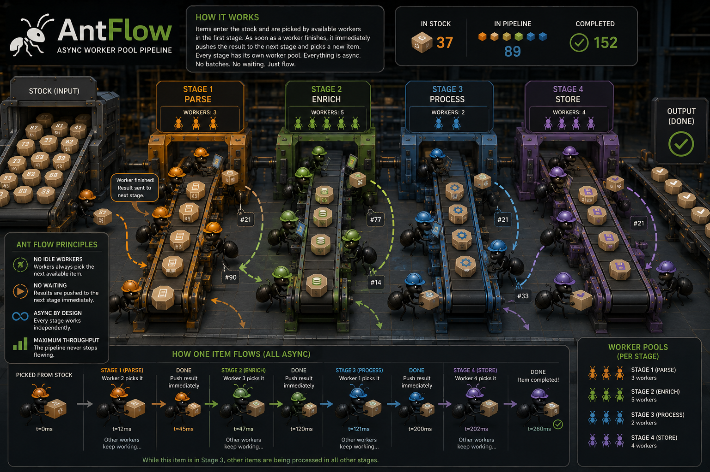

<p align="center">
  
</p>

# AntFlow

## Why AntFlow?

I was processing massive amounts of data using OpenAI's Batch API. The workflow had four steps:

1. Upload batches to OpenAI
2. Wait for processing
3. Download results
4. Save to database

I was running 10 batches at a time with basic async. The problem: I had to wait for **all 10** to finish before starting the next group.

In practice, 9 batches would finish in 5 minutes and one would take 30. That one slow batch blocked everything — 25 minutes of idle time, repeated across hundreds of batches.

AntFlow fixes this with a worker pool model: each worker picks up the next task as soon as it finishes, so slow tasks never block fast ones. Worker count, retry logic, and stage configuration stay in your hands.

My batch processing went from hours to a fraction of the time.

<p align="center">
  
</p>

---

## Install

```bash
pip install AntFlow
```

OpenTelemetry support (optional):

```bash
pip install AntFlow[opentelemetry]
```

---

## Quick Start

Three ways to create a pipeline — pick what fits:

### Fluent builder

```python
import asyncio
from antflow import Pipeline

async def fetch(x):
    await asyncio.sleep(0.1)
    return f"data_{x}"

async def main():
    results = await (
        Pipeline.create()
        .add("Fetch", fetch, workers=5, retries=3)
        .run(range(10), progress=True)
    )
    print(f"Processed {len(results)} items")

asyncio.run(main())
```

### Stage objects

```python
import asyncio
from antflow import Pipeline, Stage

async def process(x):
    await asyncio.sleep(0.1)
    return x * 2

async def main():
    stage = Stage(name="Process", workers=5, tasks=[process])
    pipeline = Pipeline(stages=[stage])
    results = await pipeline.run(range(10), progress=True)
    print(f"Processed {len(results)} items")

asyncio.run(main())
```

### One-liner

```python
import asyncio
from antflow import Pipeline

async def simple_task(x):
    return x + 1

async def main():
    results = await Pipeline.quick(range(10), simple_task, workers=5, progress=True)
    print(f"Processed {len(results)} items")

asyncio.run(main())
```

| Method | When to use |
|--------|-------------|
| Stage objects | Fine-grained control, custom callbacks, per-task concurrency limits |
| Fluent builder | Multi-stage pipelines, quick prototyping |
| `Pipeline.quick()` | Single-task scripts |

---

## Dashboards

Pipelines run silently by default. Pass `progress=True` for a progress bar, or `dashboard=` for more detail:

```python
results = await Pipeline.quick(items, task, workers=5, dashboard="detailed")
```

Options: `"compact"`, `"detailed"`, `"full"`. Use `"detailed"` on multi-stage pipelines to spot bottlenecks per stage.

---

## Streaming results

```python
import asyncio
from antflow import Pipeline

async def process(x):
    await asyncio.sleep(0.1)
    return f"result_{x}"

async def main():
    pipeline = Pipeline.create().add("Process", process, workers=5).build()

    async for result in pipeline.stream(range(10)):
        print(f"Got: {result.value}")

asyncio.run(main())
```

---

## AsyncExecutor

For simple parallel execution without pipelines:

```python
import asyncio
from antflow import AsyncExecutor

async def process_item(x):
    await asyncio.sleep(0.1)
    return x * 2

async def main():
    async with AsyncExecutor(max_workers=10) as executor:
        results = await executor.map(process_item, range(100), retries=3)
        print(f"Processed {len(results)} items")

asyncio.run(main())
```

`retries=3` means up to 4 total attempts with exponential backoff.

---

## Multi-stage pipeline

```python
import asyncio
from antflow import Pipeline, Stage

async def fetch(x):
    await asyncio.sleep(0.1)
    return f"data_{x}"

async def process(x):
    await asyncio.sleep(0.1)
    return x.upper()

async def save(x):
    await asyncio.sleep(0.1)
    return f"saved_{x}"

async def main():
    fetch_stage = Stage(
        name="Fetch",
        workers=10,
        tasks=[fetch],
        task_concurrency_limits={"fetch": 2}  # avoid rate limits
    )
    process_stage = Stage(name="Process", workers=5, tasks=[process])
    save_stage = Stage(name="Save", workers=3, tasks=[save])

    pipeline = Pipeline(stages=[fetch_stage, process_stage, save_stage])
    results = await pipeline.run(range(50), progress=True)

    print(f"Completed: {len(results)} items")
    print(f"Stats: {pipeline.get_stats()}")

asyncio.run(main())
```

Worker counts follow the workload: more for I/O-bound stages, fewer where you're rate-limited.

---

## StatusTracker

Track every item as it moves through stages:

```python
from antflow import Pipeline, Stage, StatusTracker
import asyncio

async def fetch(x): return x
async def process(x): return x * 2
async def save(x): return x

async def log_event(event):
    print(f"Item {event.item_id}: {event.status} @ {event.stage}")

tracker = StatusTracker(on_status_change=log_event)

pipeline = Pipeline(
    stages=[
        Stage(name="Fetch", workers=5, tasks=[fetch]),
        Stage(name="Process", workers=3, tasks=[process]),
        Stage(name="Save", workers=5, tasks=[save]),
    ],
    status_tracker=tracker
)

async def main():
    await pipeline.run(range(50))

    stats = tracker.get_stats()
    print(f"Completed: {stats['completed']}, Failed: {stats['failed']}")

    history = tracker.get_history(item_id=0)

asyncio.run(main())
```

**Dashboard vs StatusTracker**: dashboards poll on an interval for visual output; StatusTracker fires async callbacks on each event. Use dashboards for interactive debugging, StatusTracker for logging to external systems.

---

## Features

- Worker pool per stage — workers never block each other
- Per-task retry with exponential backoff
- Per-stage retry for transactional operations
- Priority queues — bypass sequential order when needed
- Interactive control — resume pipelines, inject items mid-run
- OpenTelemetry auto-instrumentation (optional)
- `concurrent.futures`-style API (`submit`, `map`, `as_completed`)

---

## Documentation

Full docs at [rodolfonobrega.github.io/AntFlow](https://rodolfonobrega.github.io/AntFlow/):

- [Quick Start](https://rodolfonobrega.github.io/AntFlow/getting-started/quickstart/)
- [AsyncExecutor](https://rodolfonobrega.github.io/AntFlow/user-guide/executor/)
- [Pipeline](https://rodolfonobrega.github.io/AntFlow/user-guide/pipeline/)
- [Monitoring](https://rodolfonobrega.github.io/AntFlow/user-guide/monitoring/)
- [Error Handling](https://rodolfonobrega.github.io/AntFlow/user-guide/error-handling/)
- [API Reference](https://rodolfonobrega.github.io/AntFlow/api/)
- [Examples](https://rodolfonobrega.github.io/AntFlow/examples/)

Local docs:

```bash
pip install mkdocs-material
mkdocs serve
```

---

## Requirements

- Python 3.9+
- tenacity >= 8.0.0

Python 3.9–3.10 installs the `taskgroup` backport automatically.

---

## Tests

```bash
pip install -e ".[dev]"
pytest
```

---

## Contributing

See [CONTRIBUTING.md](CONTRIBUTING.md).

---

## License

MIT — see [LICENSE](LICENSE).
